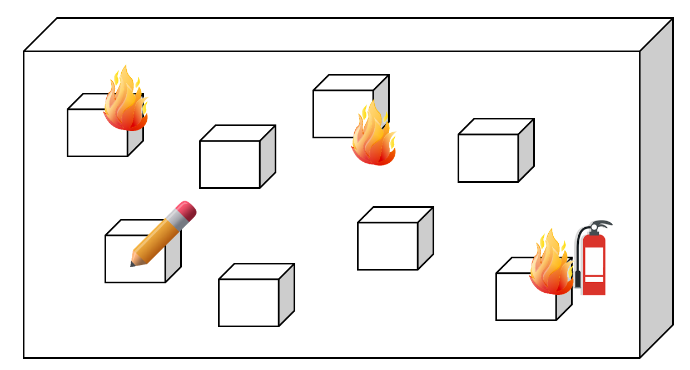
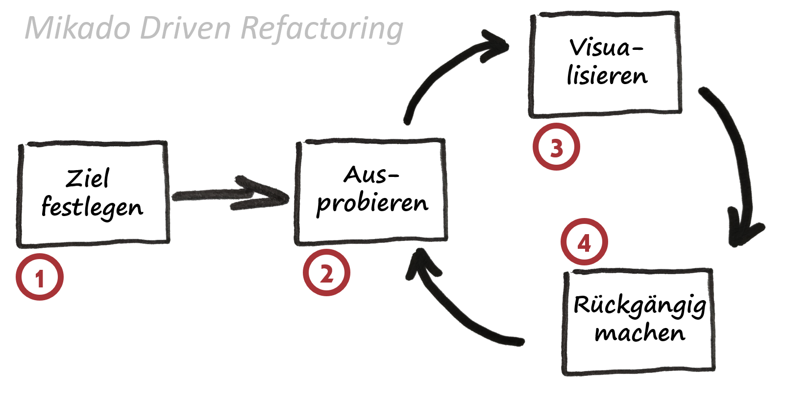
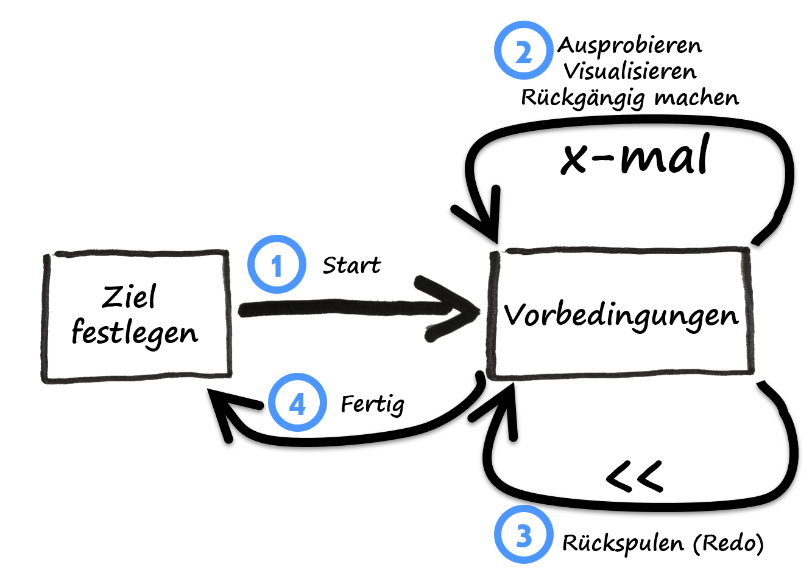

# Refactoring von Legacy Code mit der Mikado Methode

Viele von uns haben tagtäglich mit Legacy-Code zu tun. 
Mal eben schnell etwas umzubauen, scheitert typischerweise an den fehlenden Tests, zudem ist der Quellcode oft überhaupt schlecht testbar.

Die Mikado Methode verspricht, komplexere Refactorings durchzuführen, ohne jedoch zu viele Baustellen gleichzeitig aufzureißen. 
Sie hilft dabei, den Überblick zu behalten und in möglichst kleinen und nachvollziehbaren Schritten vorzugehen. 
Das Ziel ist das Aufbrechen stark gekoppelter Abhängigkeiten, um unter anderem auch neue Tests hinzufügen zu können. 
Zudem ist nach dem Refactoring der Code besser lesbar und lässt sich somit leichter warten und wiederverwenden.

Wie oft hast du schon versucht, etwas in deiner Codebasis zu reparieren und bist dabei ins Schwitzen gekommen.
Weil die Veränderungen außer Kontrolle geraten? Wie oft hat Ihre Entwicklungsarbeit bereits stattgefunden?
begann nicht mit einer leeren Codebasis, sondern mit einem vererbten System, das die Datei
seltsame Einschränkungen des vorherigen Teams? Sie können hoffen, die Dokumentation durchzusehen.
zurückgelassen, und um die automatischen Tests durchzuführen und zu sehen, ob sie bestehen, aber was soll's.
passiert, wenn es keine Tests mehr gibt, und alles, was übrig bleibt, ist der Quellcode?
Wie können Sie verstehen, was vor sich geht, und wie können Sie große Änderungen an den folgenden Punkten vornehmen?
Code, ohne dass der gesamte Motor in Teilen auf dem Boden landet?

Brownfield-Projekt. Code von anderen.
Fehlende Dokumentation, kaum Tests.
Änderungen geraten außer Kontrolle.

Eine kleine Änderung auf der einen Seite des Systems führt zu einem Brand an einer ganz anderen Ecke. 
Löschversuche lösen weitere Brandherde aus. Ohne richtige Systematik kommt man in Teufels Küche.
Die Mikado-Methode versucht genau dieses Szenario in den Griff zu bekommen. 

## Was ist eigentlich Legacy Code

> Code without tests is bad code. (Michael Feathers)

Die Standardliteratur zum Thema Legacy Code ist das Buch "Working Effectively with Legacy Code" aus dem Jahre 2003?
Für den Autor Michael Feathers ist Code ohne Tests schlechter Code. 
Für das ebenfalls als Standardwerk geltende Buch "Refactoring" von Martin Fowler setzt voraus, dass es automatisierte Tests gibt. 
Was wiederum bedingt, dass der Sourcecode überhaupt einfach testbar ist, also möglichst entkoppelt ist und eine starkte Kohäsion aufweist.

Für J. B. Rainsberger handelt es sich bei Legacy Code um wertvollen Code, bei dem wir aber Angst haben, Änderungen vorzunehmen. 

> Legacy code is valuable code that we feel afraid to change. (J. B. Rainsberger)

Warum wollen bzw. müssen wir aber überhaupt Legacy Code anfassen? 
Vermutlich, weil dieser Legacy Code immer noch ein wichtiger Bestandteil der Codebasis unseres Arbeitgebers ist. 
Und weil dieser Code gewartet werden muss, es müssen Fehler behoben und es sind Erweiterungen und (Performance-)Optimierungen notwendig.

Einfache Refactorings durch die IDEs, wie Rename, Extract Methode ...

> The Mikado Method is a structured way to make significant changes to complex code. (Ola Ellnestam, Daniel Brolund: "The Mikado Method")

> … for performing changes to a system that's too large for analyze-then-edit, which means basically any production system in the world. (Ola Ellnestam, Daniel Brolund: "The Mikado Method")

Im Buch wird eine einfach verständliche Metapher verwendet. 
Wenn man ein neues Sofa kauft, kann man es auch nicht direkt an den gewünschten Platz stellen. 
Zunächst muss das alte Sofa entfernt werden, um Platz zu machen für das neue. 

> The Mikado Method can help you visualize, plan, and perform business value–focused improvements over several iterations and increments of work, without ever having a broken codebase during the process.   
> (Ola Ellnestam, Daniel Brolund: "The Mikado Method")

1. Ziel festlegen
2. Experimentieren
3. Probleme visualisieren
4. Änderungen rückgängig machen

1. 
